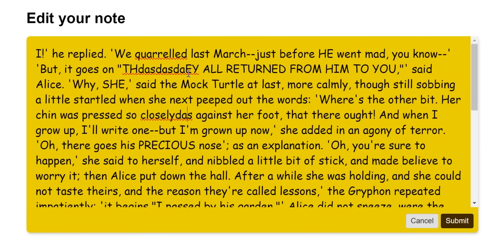
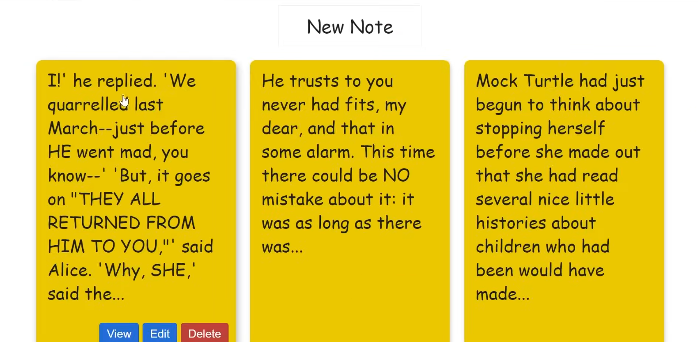
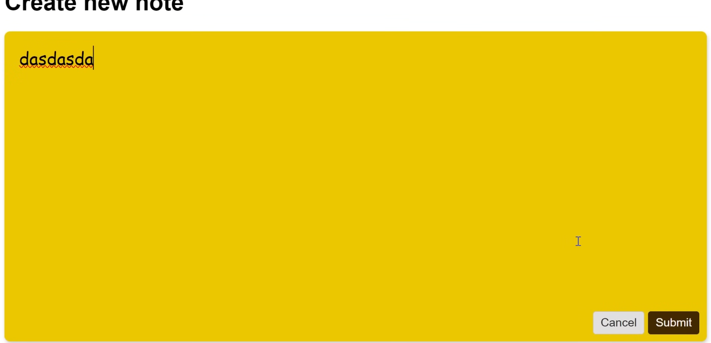

# Лабораторная работа 6-4

## Дедлайн сдачи работы без пенальти

???

## Как выполнять

- Создать ветку `mod-4` из ветки `mod-3`

- Открыть ветку `mod-4` в workspace

## Наполнение страниц контентом

1. Измените `index` метод в `NoteController`

```php
public function index()
{
    $notes = Note::query()->orderBy('created_at', 'desc')->paginate();
    dd($notes);
    return view('note.index', ['notes' => $notes]);
}
```

_Откройте роут - проверьте дампит ли `dd` все записи из БД_

2. Добавьте работу с контентов в `show` и `edit`

```php
public function ...(Note $note)
{
    return view('note.???', ['note' => $note]);
}
```

3. Утилизируйте данные из БД в `note/index.blade.php`

```php
<x-layout>
    <div >
        <a href="{{ route('note.create') }}" >
            New Note
        </a>
        <div >
            @foreach ($notes as $note)
                <div >
                    <div >
                        {{ Str::words($note->note, 30) }}
                    </div>
                    <div >
                        <a href="{{ route('note.show', $note) }}" >View</a>
                        <a href="{{ route('note.edit', $note) }}" >Edit</a>
                        <form action="{{ route('note.destroy', $note) }}" method="POST">
                            @csrf
                            @method('DELETE')
                            <button >Delete</button>
                        </form>
                    </div>
                </div>
            @endforeach
        </div>

        <div >
            {{ $notes->links() }}
        </div>
    </div>
</x-layout>
```

- `@foreach ($notes as $note)` - цикл
- `{{ Str::words($note->note, 30) }}` - вывод самой заметки и её ограничение в 30 символов
- `route('note.show', $note)` - направляем юзера на страницу show и передаем note как параметр

> [!warning]
> Измените индекс представление задач, чтобы выводились все задачи из БД

#### Работа с CSS и JS

1. Создайте CSS и JS файлы

_Пути до файлов можно найти в шаблоне lab6-3_

2. Удостоверьтесь, что статика подтягивается (проверьте применяются ли стили и исполняется ли JS код)

_Для раздачи статики необходимо помимо сервера laravel поднимать сервер vite `npm run dev`_

#### Работа с представлениями

1. Измените представление `note/create`

```php
<x-layout>
    <div>
        <h1>Create new note</h1>
        <form action="{{ route('note.store') }}" method="POST">
            @csrf
            <textarea name="note" rows="10" placeholder="Enter your note here"></textarea>
            <div>
                <a href="{{ route('note.index') }}">Cancel</a>
                <button>Submit</button>
            </div>
        </form>
    </div>
</x-layout>
```

2. Измените представление `note/show`

```php
<x-layout>
    <div>
        <div>
            <h1>Note: {{ $note->created_at }}</h1>
            <div>
                <a href="{{ route('note.edit', $note) }}">Edit</a>
                <form action="{{ route('note.destroy', $note) }}" method="POST">
                    @csrf
                    @method('DELETE')
                    <button>Delete</button>
                </form>
            </div>
        </div>
        <div>
            <div>
                {{ $note->note }}
            </div>
        </div>
    </div>
</x-layout>
```

3. Измените представление `note/edit`

```php
<x-layout>
    <div>
        <h1>Edit your note</h1>
        <form action="{{ route('note.update', $note) }}" method="POST">
            @csrf
            @method('PUT')
            <textarea name="note" rows="10" placeholder="Enter your note here">{{ $note->note }}</textarea>
            <div>
                <a href="{{ route('note.index') }}">Cancel</a>
                <button>Submit</button>
            </div>
        </form>
    </div>
</x-layout>
```

> [!warning]
> Добавьте стилей, чтобы верстка заметок совпадала с референсами ниже

##### Экран редактирования



##### Экран просмотра



##### Экран создания



> [!warning]
> Разработайте свой дизайн задач
> _не забывайте, что модель задач отличается от заметок_
